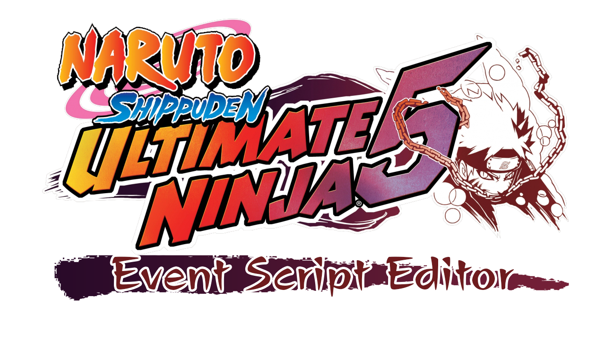

# About
This tool is designed to be a decompiler and compiler for the custom programming language used in the Event scripts of the RPG in the ADV/EVENT folder, such as Story Mode, Side Quests, NPCs, Shops, and more.
You can obtain it by going to the releases section of this page. If you encounter any bugs, please remember to report them in the issues section.
# You can check the list of available opcodes below:
**SWITCH_NOW_TO_STAGE**: Immediately switches to the requested Stage. Syntax (int StageID) 
**SWITCH_AFTER_TO_STAGE**: Switches to the Stage after something, such as after a Cutscene for example. Syntax (int StageID) 
**UPDATE_DIALOGUE**: Updates the flag of a dialogue in the MemoryCard to the requested value. Syntax (int MemoryCardOffset, int Value) 
**UPDATE_PROGRESS**: Updates the flag of a progress in the MemoryCard to the requested value. Syntax (int MemoryCardOffset, int Value) 
**SET_ITEM_TO_PLAYER**: Gives the requested item to the player and the quantity. Syntax (int ItemID, int ItemCount) 
**LOCK_PLAYER_ACTIONS**: Locks the player's actions. 
**UNLOCK_PLAYER_ACTIONS**: Unlocks the player's actions. 
**SET_PLAYER_POSITION**: Repositions the player to the requested position. Syntax (int PositionX, int PositionY, int PositionZ) 
**SET_PLAYER_ROTATION**: Repositions the player’s rotation to the requested rotation. Syntax (int RotationX, int RotationY, int RotationZ) 
**ROTATE_PLAYER_TO_NPC**: Rotates the player towards the direction of the requested NPC. Syntax (int NPCID) 
**UNLOCK_PLAYER_FROM_DIALOGUE**: Unlocks the player to be able to start another conversation. 
**SWITCH_PLAYER_TO**: Switches the player's character to the requested character. Syntax (int CharacterID) 
**SPAWN_NPC**: Spawns an NPC. Syntax (int NPCID, int StageID, int PositionX, int PositionY, int PositionZ, int RotationX, AnimationID, BalloonID) 
**REMOVE_NPC**: Removes an NPC. Syntax (int NPCID, StageID) 
**SET_NPC_POSITION_TO**: Repositions the NPC to the requested position. Syntax (int PositionX, int PositionY, int PositionZ) 
**SET_NPC_ROTATION_TO**: Repositions the NPC’s rotation to the requested rotation. Syntax (int RotationX, int RotationY, int RotationZ) 
**SPAWN_NPC_SMOKE**: Spawns an NPC with a smoke effect. Syntax (int NPCID, int StageID, int PositionX, int PositionY, int PositionZ, int RotationX, AnimationID, BalloonID) 
**REMOVE_NPC_SMOKE**: Removes an NPC with a smoke effect. Syntax (int NPCID, StageID) 
**ROTATE_NPC_TO_PLAYER**: Rotates the NPC towards the player’s direction. Syntax (int NPCID) 
**UNLOCK_NPC_TO_TALK**: Unlocks the requested NPC to be able to talk again. Syntax (int NPCID) 
**SET_INITIAL_CAMERA_POSITION_TO**: Sets the initial camera position to the requested position. Syntax (int PositionX, int PositionY, int PositionZ) 
**SET_FINAL_CAMERA_POSITION_TO**: Sets the final camera position to the requested position. Syntax (int PositionX, int PositionY, int PositionZ, int AnimationSpeed, int Unk) 
**SET_INITIAL_CAMERA_ROTATION_TO**: Sets the initial camera rotation to the requested rotation. Syntax (int RotationX, int RotationY, int RotationZ) 
**SET_FINAL_CAMERA_ROTATION_TO**: Sets the final camera rotation to the requested rotation. Syntax (int RotationX, int RotationY, int RotationZ, int AnimationSpeed, int Unk) 
**START_CAMERA_ANIMATION**: Starts the camera animation with the previously defined values. 
**UNLOCK_CAMERA**: Unlocks camera control. 
**SHOW_DIALOGUE**: Displays a dialogue, with the NPC’s name, message, and audio in rpgvoice.afs. Syntax (string NPCName, string NPCMessage, int SubAFSID, int AHXADXID) 
**CLOSE_DIALOGUE**: Closes the open dialogue. 
**SHOW_ANSWER_BOX**: Displays a box with alternatives. Syntax (string Option1, string Option2, string Option3, string Option4, int PreselectedOption) 
**CLOSE_ANSWER_BOX**: Closes the open alternatives box. 
**SHOW_OBTAINED_ITEM_MESSAGE**: Displays a message for the item that was obtained. Syntax (int ItemID) 
**CLOSE_OBTAINED_ITEM_MESSAGE**: Closes the open message for the obtained item. 
**SHOW_ACT_ANIMATION**: Starts an animation for the requested act. Syntax (int ActID) 
**START_2D_BATTLE**: Starts the requested 2D battle. Syntax (int BattleID) 
**START_3D_BATTLE**: Starts the 3D battle with the previously defined settings. 
**ADD_TO_3D_BATTLE**: Adds the requested configuration to the 3D battle. 
**START_CUTSCENE**: Starts the requested cutscene. Syntax (int CutsceneID) 
**SHOW_SAVE_OPTION**: Displays the save option box. 
**SHOW_LETTER**: Displays the requested letter. Syntax (int LetterID) 
**INDICATE_OBJECTIVE_ON_STAGE**: Indicates on the map where the objective is located. Syntax (int StageID) 
**START_TIME_ATTACK**: Starts a time attack. Syntax (int Minutes, int Seconds, int Milliseconds) 
**DISABLE_BANDITS_ON_STAGE**: Disables the bandits on the requested map. 
**SHOW_SHOP_MENU**: Displays the Shop Menu. 
**SHOW_RECORD_MENU**: Displays the Record Menu. 
**SHOW_INFORMATION**: Displays an information message. Syntax (int InformationID) 
**SHOW_MISSION_RESULT**: Displays the result of the Side Quest. 
**SPAWN_TRAP**: Spawns the requested trap on the map. 
**START_RETRY_MENU**: Displays the restart menu. 
**SHOW_EDIT_GROUP_MENU**: Displays the edit group menu. 
**PLAY_VAG_SOUND**: Plays the requested vag audio in snddata.bin. Syntax (int VagID) 
**PLAY_AFS_SOUND**: Plays the requested audio in afs. Syntax (int SubAFSID, int AHXADXID) 
**WAIT**: Waits the requested time before executing the next Script. Syntax (int Time) 
